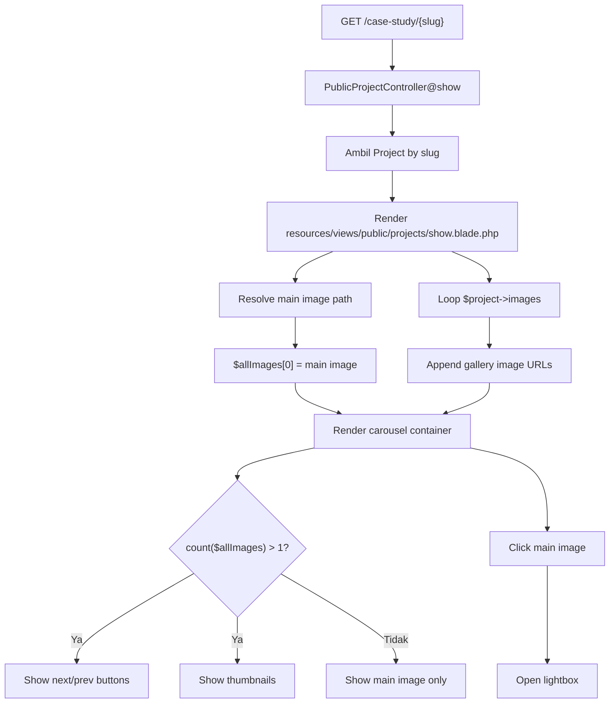

# QA Report — Modul Image Gallery Project

Tanggal: 2026-07-09  
Scope verifikasi ulang: modul image gallery pada halaman public case study `resources/views/public/projects/show.blade.php`, upload/edit/delete gallery, storage, validation, dan test coverage.

## Koreksi hasil verifikasi ulang

Temuan awal yang menyebut gallery belum tampil di show landing page **dikoreksi**.

Gallery **sudah tampil** pada halaman public case study:

- `resources/views/public/projects/show.blade.php:176-187` — membangun `$allImages` dari main image + `$project->images`.
- `resources/views/public/projects/show.blade.php:189-225` — render carousel + thumbnail gallery.
- `resources/views/public/projects/show.blade.php:436-568` — render lightbox + JS next/prev/escape close.

Yang belum tampil adalah gallery pada **admin detail project** `resources/views/projects/show.blade.php`. Jika requirement klien hanya untuk landing/public project page, maka P0 awal bukan blocker untuk requirement tersebut.

---

## Ringkasan eksekutif

Modul gallery public sudah berjalan secara konsep:

- Main image digabung dengan gallery images menjadi satu carousel.
- Thumbnail muncul jika total image lebih dari satu.
- Lightbox tersedia saat main image diklik.
- Next/previous navigation tersedia jika image lebih dari satu.
- Gallery image disimpan ke `storage/app/public/projects/gallery` dan dipanggil via `asset('storage/' . $img->image_path)`.

Namun masih ada risiko QA yang perlu diantisipasi:

1. Total jumlah gallery belum dibatasi secara akumulatif per project.
2. Upload gallery tidak atomic; file dan database bisa tidak sinkron.
3. Delete gallery mengabaikan kegagalan hapus file.
4. Public carousel memakai original image untuk thumbnail dan main display.
5. Belum ada automated test untuk gallery public carousel.
6. Admin detail project belum menampilkan gallery sebagai read-only confirmation.

Prioritas terbaik: tambah test + guard kecil dulu. Jangan tambah package.

---

## File yang diaudit

| Area | File | Status |
|---|---|---|
| Public project detail | `resources/views/public/projects/show.blade.php` | Gallery carousel + lightbox sudah ada. |
| Admin project detail | `resources/views/projects/show.blade.php` | Belum render gallery. Bukan blocker public landing, tapi gap admin QA. |
| Admin create project | `resources/views/projects/create.blade.php` | Upload gallery + JS preview. |
| Admin edit project | `resources/views/projects/edit.blade.php` | Upload tambahan + management delete gallery. |
| Service layer | `app/Services/ProjectService.php` | Create/update/force-delete file gallery. |
| Controller | `app/Http/Controllers/ProjectController.php` | CRUD project + deleteGalleryImage. |
| Public controller | `app/Http/Controllers/PublicProjectController.php` | Ambil project public by slug. |
| Validation | `app/Http/Requests/StoreProjectRequest.php`, `app/Http/Requests/UpdateProjectRequest.php` | Validasi upload gallery. |
| Models | `app/Models/Project.php`, `app/Models/ProjectImage.php` | Relasi project image. |
| Migration | `database/migrations/2026_07_07_232526_create_project_images_table.php` | Tabel `project_images`. |
| Routes | `routes/web.php` | Delete gallery route. |
| Tests | `tests/Feature/ProjectCrudTest.php` | Belum cover gallery. |

---

## Flow gallery public yang sudah ada



---

## Temuan QA terverifikasi

### P1 — Total gallery bisa melebihi 10 foto lewat edit berulang

**Lokasi:**
- `app/Http/Requests/StoreProjectRequest.php:40`
- `app/Http/Requests/UpdateProjectRequest.php:42`
- `app/Services/ProjectService.php:73-82`

**Temuan:**  
Validasi `gallery_images => nullable|array|max:10` membatasi jumlah file dalam satu request, bukan total image per project. Pada edit, admin bisa upload 10 foto berkali-kali.

**Skenario gagal:**
1. Project sudah punya 10 gallery images.
2. Admin buka edit project dan upload 10 image lagi.
3. Validasi lolos karena request baru tetap berisi 10 file.
4. Public carousel memuat 20+ image original.
5. Halaman public makin berat dan storage membengkak.

**Solusi terbaik:**
- Enforce total cap: `existing gallery count + uploaded count <= 10`.
- Terapkan di `UpdateProjectRequest::withValidator()` atau service sebelum simpan.

**Patch minimal:**
- Ambil project dari route.
- Hitung `$project->images()->count()`.
- Jika total > 10, tambahkan validation error `Gallery may not contain more than 10 photos.`

---

### P1 — Upload gallery tidak atomic; file dan database bisa tidak sinkron

**Lokasi:** `app/Services/ProjectService.php:31-42`, `app/Services/ProjectService.php:71-82`

**Temuan:**  
Project dibuat/diupdate, lalu file gallery disimpan satu per satu, lalu record `project_images` dibuat satu per satu. Tidak ada transaction dan tidak ada cleanup file jika proses tengah jalan gagal.

**Skenario gagal:**
1. Admin upload 5 images.
2. File ke-3 gagal tersimpan karena disk penuh/permission error.
3. Project sudah tersimpan, sebagian file sudah ada, sebagian record sudah dibuat.
4. Gallery tampil tidak lengkap atau ada orphan file.

**Solusi terbaik:**
- Buat helper `storeGalleryImages(Project $project, array $images)`.
- Catat semua path file yang berhasil disimpan.
- Jika terjadi exception, hapus path yang sudah tersimpan.
- Bungkus DB writes dengan `DB::transaction()`.

---

### P1 — Delete gallery mengabaikan kegagalan hapus file

**Lokasi:** `app/Http/Controllers/ProjectController.php:176-184`

**Temuan:**  
`deleteGalleryImage()` memanggil `Storage::disk('public')->delete($image->image_path)`, tetapi return value tidak dicek. Record database tetap dihapus walaupun file gagal dihapus.

**Skenario gagal:**
1. File gallery tidak bisa dihapus karena permission/storage issue.
2. `Storage::delete()` return `false`.
3. Code tetap `$image->delete()`.
4. DB record hilang, file orphan tertinggal.

**Solusi terbaik:**
- Pindahkan logic delete ke `ProjectService`.
- Jika file masih ada dan gagal dihapus, jangan hapus record.
- Tampilkan flash error.
- Tambahkan audit log delete gallery.

**Patch minimal:**
```php
if (Storage::disk('public')->exists($image->image_path) && ! Storage::disk('public')->delete($image->image_path)) {
    return back()->with('error', 'Failed to delete gallery image file.');
}

$image->delete();
```

---

### P1 — Belum ada automated test untuk gallery public

**Lokasi:** `tests/Feature/ProjectCrudTest.php:84-196`

**Temuan:**  
Tests project CRUD hanya cover main image. Belum ada test yang memastikan gallery image tersimpan dan tampil di public case study carousel.

**Skenario gagal:**
1. Developer refactor `ProjectService` atau `public/projects/show.blade.php`.
2. Gallery upload/render rusak.
3. Test suite tetap hijau karena tidak ada assertion gallery.

**Solusi terbaik:**
Tambah file test khusus `tests/Feature/ProjectGalleryTest.php`.

**Minimal test wajib:**
- `test_authenticated_user_can_store_project_with_gallery_images`
- `test_public_project_case_study_shows_gallery_carousel_images`
- `test_authenticated_user_can_delete_gallery_image`
- `test_force_delete_project_removes_gallery_files`
- `test_gallery_upload_rejects_more_than_ten_images`

---

### P2 — Public carousel memakai original image untuk thumbnail

**Lokasi:** `resources/views/public/projects/show.blade.php:183-225`

**Temuan:**  
Thumbnail carousel memakai URL file original yang sama dengan main display. Jika gallery berisi banyak file 4MB, browser tetap mengunduh file besar untuk thumbnail kecil.

**Skenario gagal:**
1. Project punya banyak gallery image resolusi besar.
2. Visitor mobile membuka case study.
3. Halaman mengunduh banyak original image.
4. Load lambat, Core Web Vitals turun, UX buruk.

**Solusi terbaik:**
- Tahap cepat: tambah `loading="lazy"` dan `decoding="async"` pada thumbnail image.
- Tahap lanjut: generate thumbnail saat upload.

**Patch minimal:**
```blade

```

---

### P2 — JS preview create/edit bisa freeze jika admin drag terlalu banyak file

**Lokasi:**
- `resources/views/projects/create.blade.php:197-218`
- `resources/views/projects/edit.blade.php:256-277`

**Temuan:**  
Preview memakai `FileReader.readAsDataURL()` untuk semua selected files. Client-side belum membatasi 10 file dan 4MB/file sebelum preview.

**Skenario gagal:**
1. Admin drag 80 foto kamera.
2. Browser mencoba membaca semua file menjadi base64 preview.
3. Tab freeze/crash sebelum server validation berjalan.

**Solusi terbaik:**
- Guard client-side: max 10 files, max 4MB/file, image-only.
- Server validation tetap jadi sumber kebenaran.

---

### P2 — `ProjectImage` belum mengikuti konvensi model Laravel 13 repo

**Lokasi:** `app/Models/ProjectImage.php:12`

**Temuan:**  
Model memakai `$fillable`, sedangkan repo memakai PHP 8 attribute `#[Fillable(...)]` untuk model attributes.

**Rule repo:** `CLAUDE.md` — “Model attributes use PHP 8.x attributes instead of traditional `$fillable`/`$hidden` arrays.”

**Dampak:**  
Style model tidak konsisten dengan `Project` dan `User`.

**Solusi terbaik:**
```php
use Illuminate\Database\Eloquent\Attributes\Fillable;

#[Fillable(['project_id', 'image_path'])]
class ProjectImage extends Model
```

---

### P2 — Delete gallery route memakai ID global, belum scoped ke project

**Lokasi:** `routes/web.php:34`, `app/Http/Controllers/ProjectController.php:176-178`

**Temuan:**  
Route delete memakai `manage/projects/gallery/{id}` lalu `ProjectImage::findOrFail($id)`. Untuk kondisi single-admin saat ini masih cukup. Namun jika nanti ada multi-role/editor scoped project, ini rawan IDOR.

**Skenario gagal nanti:**
1. Editor hanya boleh manage project A.
2. Editor tahu ID image project B.
3. Editor submit DELETE ke `/manage/projects/gallery/{id}`.
4. Image project B terhapus.

**Solusi terbaik:**
- Ubah route jadi nested: `manage/projects/{project}/gallery/{image}`.
- Query image lewat project: `$project->images()->findOrFail($imageId)`.
- Tambah policy saat role/ownership diterapkan.

---

### P3 — Admin detail project belum menampilkan gallery sebagai verifikasi internal

**Lokasi:** `resources/views/projects/show.blade.php:16-118`

**Temuan:**  
Halaman public sudah menampilkan gallery. Namun halaman admin detail belum menampilkan gallery. Ini bukan blocker landing page, tapi gap QA internal: admin tidak bisa memverifikasi gallery dari halaman detail admin.

**Skenario UX:**
1. Admin upload gallery.
2. Admin buka detail project di dashboard.
3. Admin hanya melihat main image.
4. Admin harus buka public page atau edit page untuk memastikan gallery.

**Solusi terbaik:**
- Tambah section read-only `Project Gallery` di admin detail.
- Tambah empty state `No gallery photos uploaded yet.`
- Tambah tombol `Edit Project` di header detail untuk manage gallery.

---

### P3 — Lightbox tidak punya tombol next/prev saat modal terbuka

**Lokasi:** `resources/views/public/projects/show.blade.php:436-568`

**Temuan:**  
Carousel punya next/prev di main display, tetapi lightbox hanya menampilkan satu image dan close. User harus tutup lightbox untuk pindah image.

**Skenario UX:**
1. Visitor klik image untuk membuka lightbox.
2. Visitor ingin melihat image berikutnya fullscreen.
3. Tidak ada tombol next/prev di lightbox.

**Solusi terbaik:**
- Tambah next/prev button di lightbox.
- Pakai `currentImageIndex` yang sudah ada.
- Tambah keyboard arrow left/right.

**Catatan:** nice-to-have, bukan bug blocking.

---

## QA checklist manual revisi

| Skenario | Expected |
|---|---|
| Public case study tanpa gallery | Main image tampil, tidak ada thumbnail/arrow, JS tidak error. |
| Public case study dengan 1 gallery image | Main image + 1 gallery image masuk carousel, thumbnail muncul. |
| Public case study dengan 10 gallery images | Carousel menampilkan main image + 10 gallery image. |
| Klik thumbnail | Main image berubah sesuai thumbnail. |
| Klik next/prev | Image berpindah dan wrap ke awal/akhir. |
| Klik main image | Lightbox terbuka dengan image aktif. |
| Tekan Escape | Lightbox tertutup. |
| Upload gallery saat create | File tersimpan di storage dan record `project_images` dibuat. |
| Upload gallery saat edit | Image baru bertambah tanpa menghapus existing gallery. |
| Upload > 10 dalam satu request | Validasi gagal. |
| Upload 10 berkali-kali | Harus gagal setelah total cap diterapkan. |
| Delete gallery image | File dan DB record hilang, flash success. |
| Delete gagal di storage | Record tidak dihapus, flash error. |
| Force delete project | Main image + gallery files + DB records hilang. |
| Soft delete project | Main image + gallery files tetap ada untuk restore. |
| Admin detail project | Sebaiknya menampilkan gallery read-only untuk QA internal. |

---

## Rekomendasi patch bertahap revisi

### Tahap 1 — Test dan guard public gallery

1. Tambah `ProjectGalleryTest` untuk upload + public carousel render.
2. Enforce total max 10 images per project.
3. Tambah `loading="lazy"` dan `decoding="async"` pada thumbnails public.

### Tahap 2 — Data/file consistency

1. Refactor upload gallery ke helper service.
2. Tambah rollback cleanup file jika upload/DB insert gagal.
3. Perbaiki delete gallery agar cek hasil `Storage::delete()`.
4. Tambah audit log delete gallery.

### Tahap 3 — Admin QA dan UX

1. Render gallery read-only di `resources/views/projects/show.blade.php`.
2. Tambah empty state di admin detail/edit.
3. Tambah tombol `Edit Project` dari admin detail.
4. Optional: next/prev di lightbox fullscreen.

---

## Kesimpulan revisi

Halaman public `resources/views/public/projects/show.blade.php` **sudah menampilkan image gallery** lewat carousel + thumbnails + lightbox. Jadi modul landing/public tidak kosong.

Masalah utama sekarang bukan “gallery tidak tampil di public”, tetapi:

1. Belum ada automated test untuk memastikan gallery public tetap tampil.
2. Total gallery bisa melewati batas 10 lewat edit berulang.
3. Upload/delete belum aman dari kondisi file/DB tidak sinkron.
4. Public thumbnail masih memakai original image.
5. Admin detail `resources/views/projects/show.blade.php` belum menampilkan gallery sebagai verifikasi internal.

Patch minimal terbaik: test public gallery + enforce total cap + perbaiki delete/upload consistency. Admin detail gallery jadi tambahan UX internal, bukan blocker public landing.
