# Flowchart Sistem SEO CMS SJA

Dokumen ini menjelaskan alur SEO publik di CMS SJA memakai Mermaid chart. Fokus: crawler control, sitemap, metadata publik, project SEO, JSON-LD, test, dan deploy.

## File utama

| Area | File | Fungsi |
|---|---|---|
| Robots | `public/robots.txt` | Mengizinkan crawler publik, memblokir admin/auth/private path, menunjuk sitemap. |
| Sitemap | `public/sitemap.xml` | Menyediakan URL publik stabil: `/` dan `/projects`. |
| SEO partial | `resources/views/partials/public-seo.blade.php` | Render meta description, canonical, Open Graph, Twitter Card. |
| Homepage | `resources/views/welcome.blade.php` | Render SEO default dari settings + `Organization` JSON-LD. |
| Projects index | `resources/views/public/projects/index.blade.php` | Render SEO portfolio/projects list. |
| Project detail | `resources/views/public/projects/show.blade.php` | Render SEO detail project pakai `meta_title`, `meta_description`, image. |
| Routes publik | `routes/web.php` | Menentukan halaman publik yang bisa dicrawl. |
| Project model | `app/Models/Project.php` | Menyimpan field `meta_title` dan `meta_description`. |
| Test SEO | `tests/Feature/PublicSeoTest.php` | Memastikan canonical, OG, Twitter Card, dan JSON-LD muncul. |

---

## 1. Arsitektur SEO publik

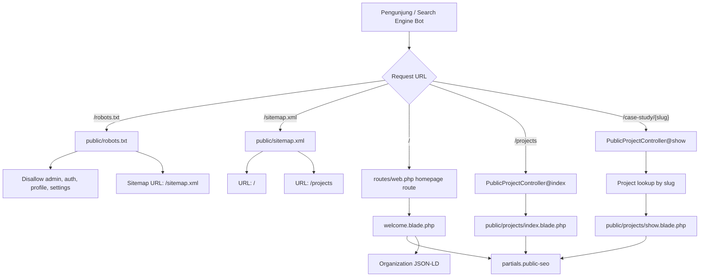

Ringkas: semua halaman publik pakai metadata HTML langsung dari Blade. Tidak ada package SEO tambahan.

---

## 2. Alur crawler dan indexing

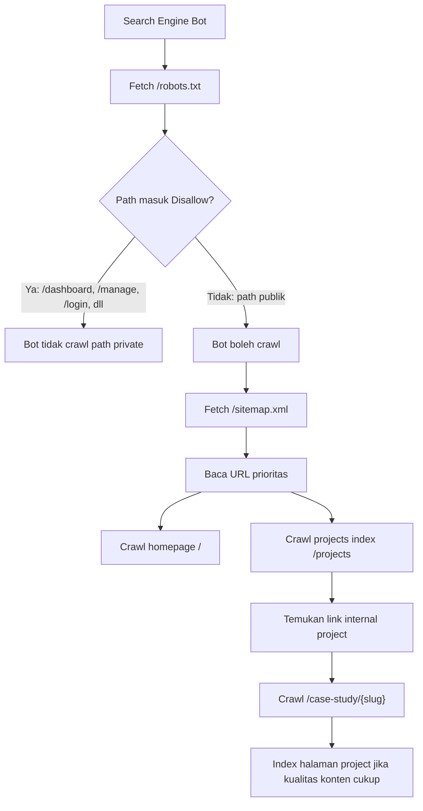

Catatan penting: detail project belum masuk sitemap statis. Saat ini project detail ditemukan lewat internal link dari halaman projects/homepage.

---

## 3. Alur render metadata SEO reusable

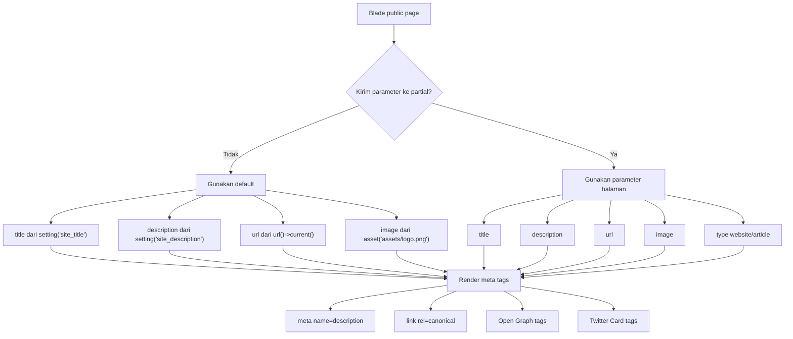

Partial utama: `resources/views/partials/public-seo.blade.php`.

---

## 4. Alur homepage SEO

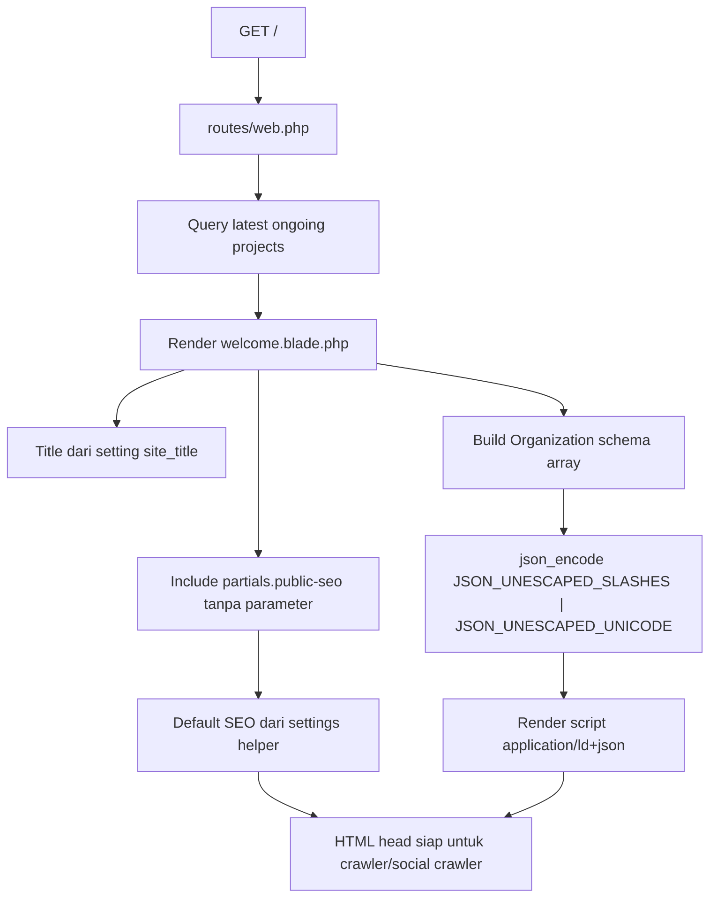

Output homepage:
- `<title>` dari `site_title`
- meta description dari `site_description`
- canonical current URL
- Open Graph default
- Twitter Card default
- `Organization` JSON-LD

---

## 5. Alur projects index SEO

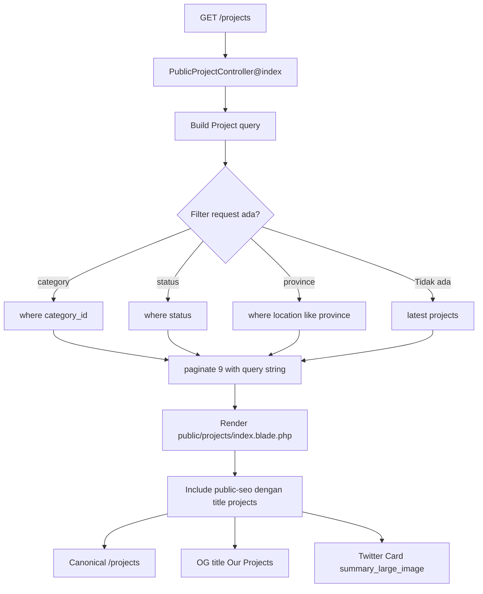

Catatan: canonical index selalu `route('public.projects.index')`, bukan URL dengan query filter. Ini mencegah variasi filter menjadi canonical duplicate.

---

## 6. Alur project detail SEO

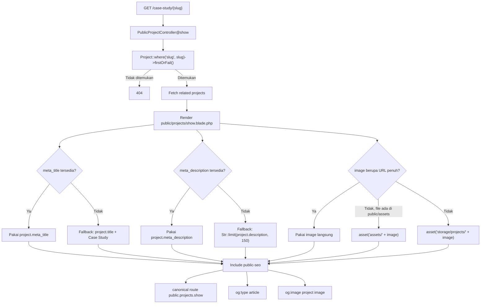

Project detail adalah halaman SEO paling penting karena berisi case study dan keyword spesifik project.

---

## 7. Alur data SEO project dari admin ke publik

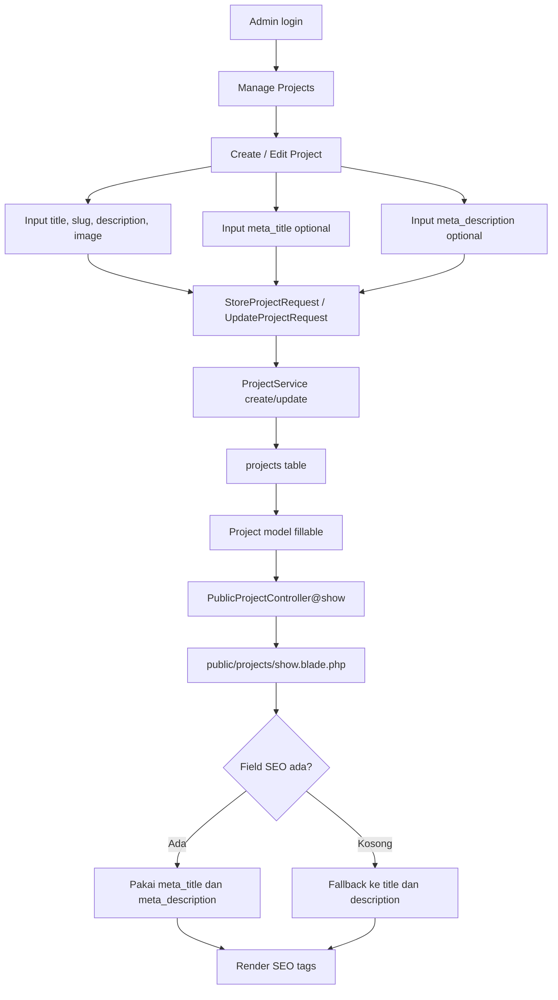

Fitur SEO project sudah aman karena field optional. Kalau admin lupa isi meta, halaman tetap punya fallback.

---

## 8. Alur social sharing preview

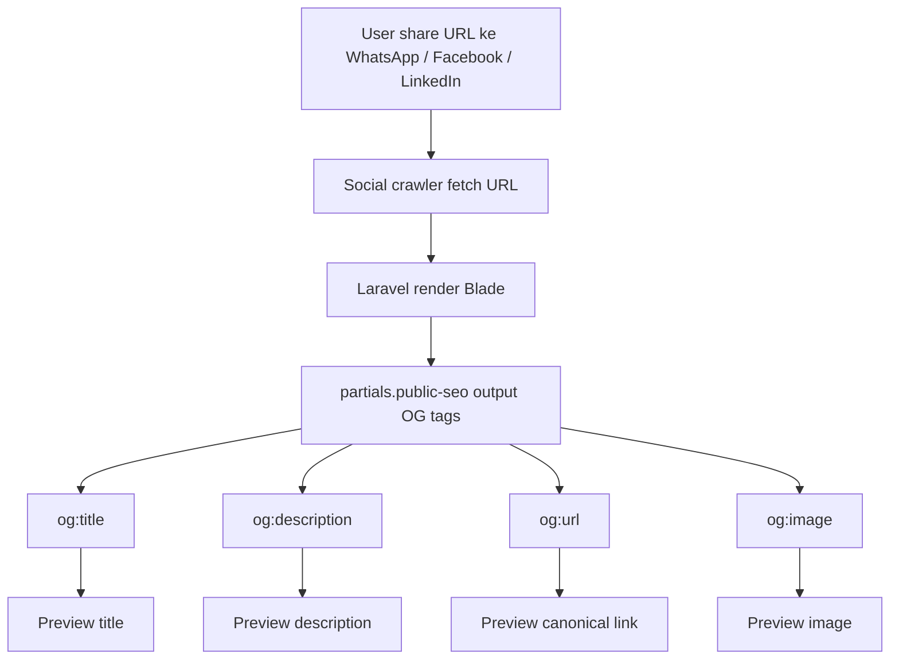

Social preview sekarang tidak bergantung pada crawler menebak konten halaman.

---

## 9. Alur testing SEO

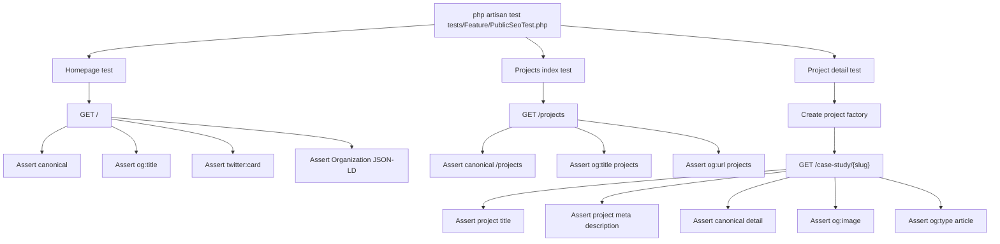

Test ini menjaga SEO dasar tidak hilang saat Blade diubah.

---

## 10. Alur deploy SEO ke hosting

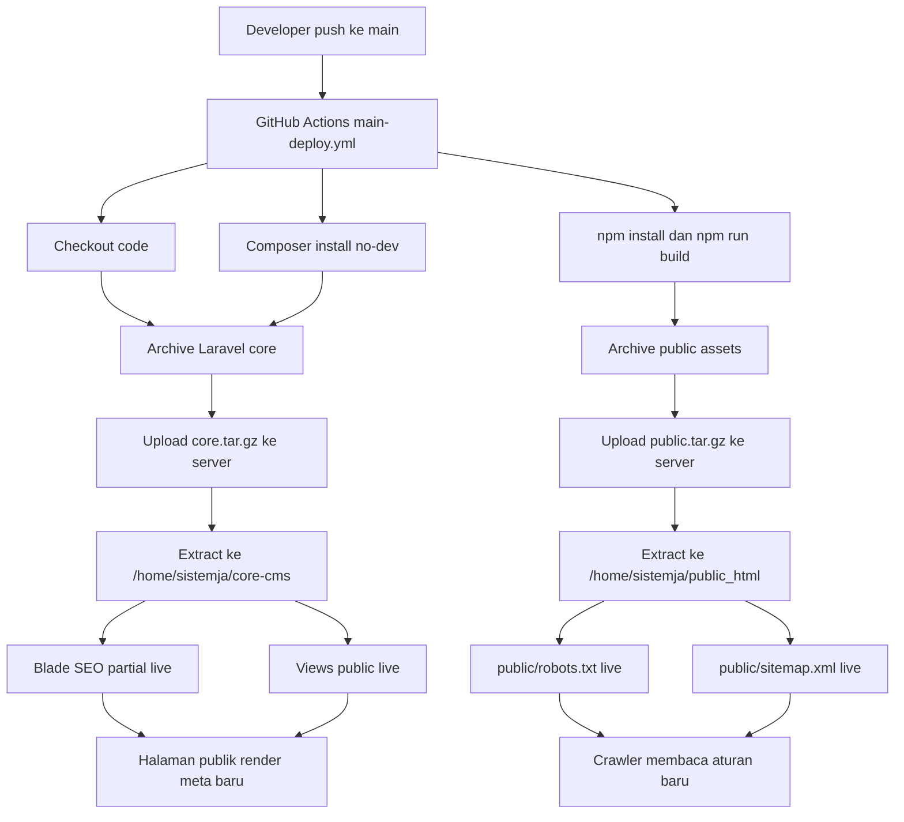

SEO berubah live setelah workflow deploy sukses.

---

## 11. Batasan sistem SEO sekarang

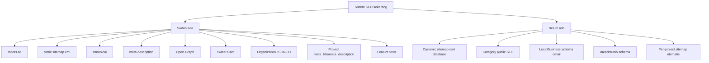

Upgrade berikutnya paling masuk akal: dynamic sitemap jika jumlah project sering berubah.

---

## 12. Ringkasan flow end-to-end

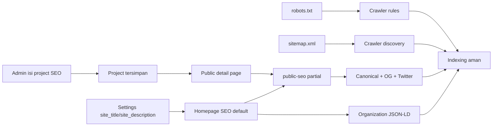

Satu sumber metadata publik: `resources/views/partials/public-seo.blade.php`. Halaman publik hanya memberi parameter sesuai konteks.
